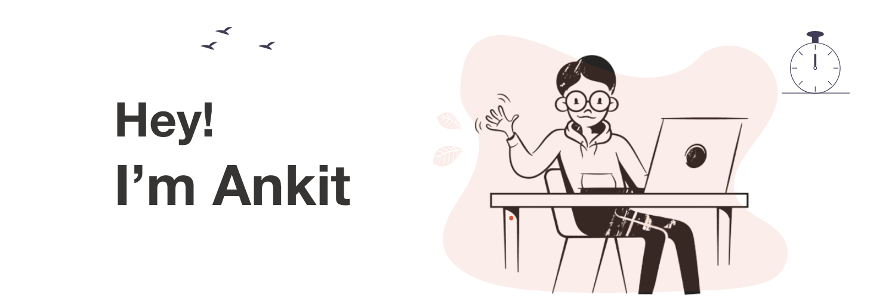

|  |
| ------ |

## Ankit Raj (he/him)

**Welcome!** I'm Ankit. I'm in the final year of learning Computer Science Engineering at NIT karnataka, India. On my github you will find projects based on my undergraduation courses.
 

When I'm not coding I enjoy planting, reading self-help books and I'm a big sucker of underrated movies.
 
<h3  >Languages, Frameworks and Tools:</h3>

     
     
     
     
     
     

